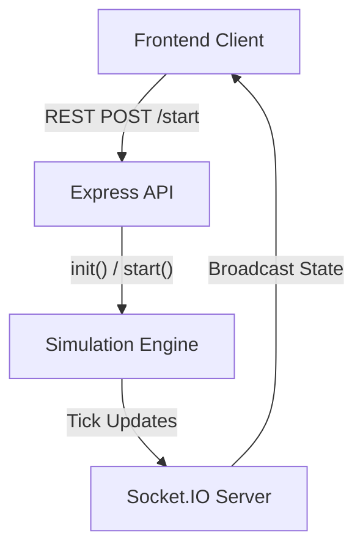
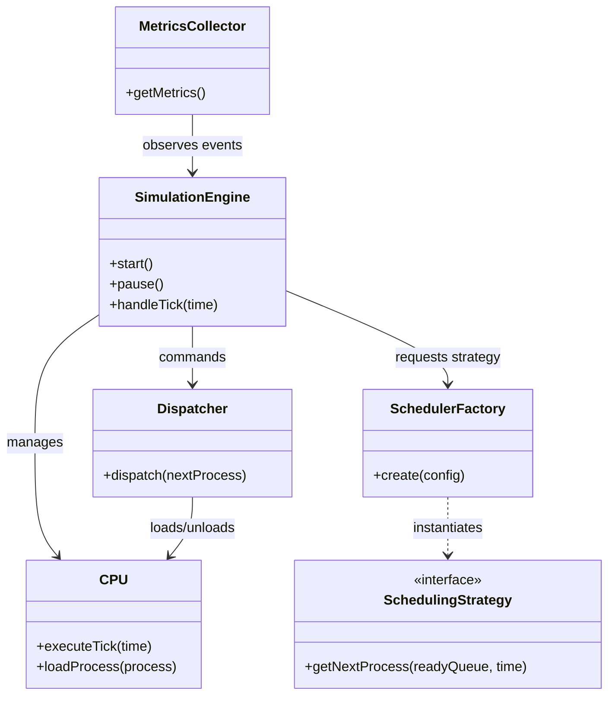
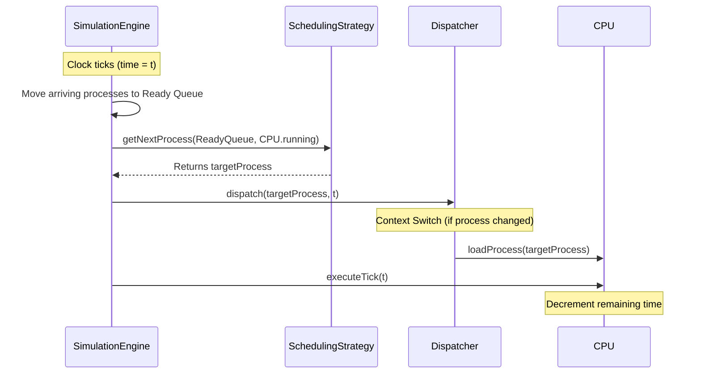

# Architecture & Low-Level Design

Scheduler Lab is built with a clear separation of concerns in mind, dividing the computational heavy lifting of CPU scheduling from the visual rendering.

## Technology Stack

### Frontend
- **Framework**: React (Bootstrapped with Vite)
- **Styling**: Tailwind CSS for utility-first styling, heavily leveraging CSS variables for dynamic Light and Dark mode theming.
- **Animations**: Framer Motion for complex layout transitions, process nodes rendering, and smooth state changes.
- **State Management**: Zustand for global client-side state, holding simulation metrics, process states, and event logs.
- **Networking**: Socket.IO-Client for real-time WebSocket communication with the backend.

### Backend
- **Runtime**: Node.js with TypeScript
- **Server**: Express for RESTful API endpoints and Socket.IO for duplex communication.
- **Testing**: Jest for validating scheduling algorithm output and engine constraints.

---

## Architectural Overview

The backend acts as the authoritative source of truth. It executes the simulation through an event-driven `SimulationEngine` and broadcasts state updates to the frontend at a defined tick rate. The frontend acts entirely as a dumb visualizer, reacting to incoming states and events.

---

## Low-Level Design (LLD): Backend Core

The backend architecture is modeled heavily around physical operating system concepts. It strictly enforces a separation between the entity managing the CPU (Dispatcher) and the entity making decisions (Scheduler).

### Core Components

1. **SimulationEngine**: The orchestrator. It manages the `Clock`, `CPU`, `Dispatcher`, and `MetricsCollector`. It holds the master process queues and emits domain events (`TICK`, `PROCESS_ARRIVAL`, `SIMULATION_COMPLETED`).
2. **Scheduler Strategies**: Pure functions responsible solely for deciding which process goes next. They conform to the `SchedulingStrategy` interface. Algorithms like `FCFS`, `SJF`, and `RR` implement their distinct logic without modifying core engine state.
3. **Dispatcher**: Handles the mechanics of loading a process into the CPU and unloading it (Context Switching).
4. **MetricsCollector**: A purely reactive observer. It listens to event streams to aggregate throughput, CPU utilization, turnaround times, and waiting times.
5. **Clock**: Controls the passage of time. It can be paused, resumed, and throttled to change the physical speed of the simulation loop.

### Entity Relationship & Workflow

---

## Event-Driven Simulation Loop

The engine's tick loop represents one unit of CPU time. The workflow executed on every tick ensures accurate time-keeping and process movement.

## Frontend Synchronization

The frontend maintains synchronization with the backend via a continuous WebSocket feed.

1. **Initialization**: On page load, the frontend explicitly calls `apiClient.reset()` to flush any lingering backend state, ensuring a clean slate.
2. **State Updates**: The backend broadcasts a complete `SimulationStateDTO` on every tick. The frontend replaces its local state representation seamlessly.
3. **Discrete Events**: Alongside full state replacements, the backend sends discrete domain events (e.g., `PROCESS_ARRIVAL`, `CONTEXT_SWITCH`). The frontend intercepts these to populate the real-time Event Log Console.
4. **Resilience**: A loading state blocks the UI while the frontend attempts to connect to the backend WebSocket, masking server cold-starts in cloud environments.
